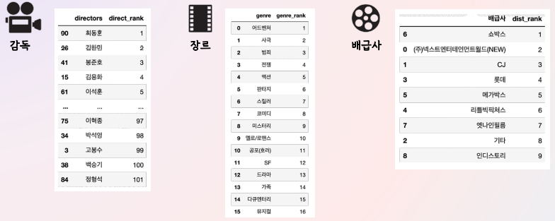
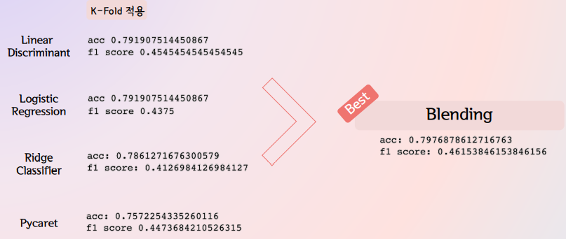

# 영화 흥행 예측 모델
- 기획 

  - 최근에 KT에서 시나리오로 영화 흥행을 예측하는 AI를 개발하고 있고 Hollywood에서도 영화흥행을 예측하려고 노력 중이라는 기사들을 읽으면서 우리나라 영화들로만 가지고 한국에서 흥행을 할지 못할지 예측해주는 모델을 구축해보기로 했다.
  - 흥행의 기준이 애매하긴 하지만 관객수나 매출액 보다는 손익분기점을 넘긴 영화가 성공했다고 기준을 잡기가 더 쉽다 판단하여 손익분기점으로 결정
  - 데이터는 크롤링과 KOBIS, KMDB에서 가져옴

- 전처리

  - SNS feature를 사용하기 위해 한국에서 sns를 사용하기 시작한 대략 2010년도부터 2020년 전까지의 영화들만 가져왔고 2020년부터 2022년은 코로나 시대였기 때문에 특수한 상황이라 판단해 배제하기로 결정

  - 성인영화, 애니메이션은 제외

  - 범주형 데이터는 관객 수의 중위값 혹은 평균값을 기준으로 해 등급 처리

    

  - 총 데이터 576개

- Features

  - 배급사, 장르, 감독, movie buzz(네이버 영화 리뷰, 네이버 영화 기대지수, 구글트렌드), star buzz(영화의 주연 및 조연 배우 5명이 네이버 블로그에 언급된 수)
  - 배급사, 장르, 감독은 KOBIS와 KMDB에서 제공해주는 데이터 활용
  - movie buzz와 star buzz는 크롤링
  - movie buzz와 star buzz는 각각 개봉일 한달 전부터 개봉일 전날까지의 데이터를 가져옴

- Target

  - 타겟은 매출액이 손익분기점을 넘겼으면 1, 못넘겼으면 0으로 지정
  - 손익분기점은 제작비의 3배로 잡음

- Model

  - 총 9가지 알고리즘을 시도 했을 때 가장 높은 정확도와 F1 score를 보인 Linear discriminant, Logistic regression, Ridge classifier, Pycaret을 가져와 K-Fold를 해준 후 blending 했을 때 0.7976의 정확도와 0.4615의 f1 score를 산출해줌

    

  - Pycaret은 F1 score을 기준으로 돌림

- References

  - Lee, K., Park, J., Kim, I., Choi, Y. 2016. Predicting movie success with machine learning techniques: ways to improve accuracy. 7-22. 
  - 영화 관객수 예측 모델 개발. 기세현. 2021. Retrieved from https://dacon.io/competitions/open/235536/codeshare/2721?page=1&dtype=recent 
  - 손익분기점 계산하는 방법. 백가. 2017. Retrieved from https://extmovie.com/movietalk/22114716 
  - 영화 손익분기점 계산과 영화표 가격의 수익 배분율. 공손한 곰탱이. 2017. Retrieved from https://goodnine.tistory.com/268

